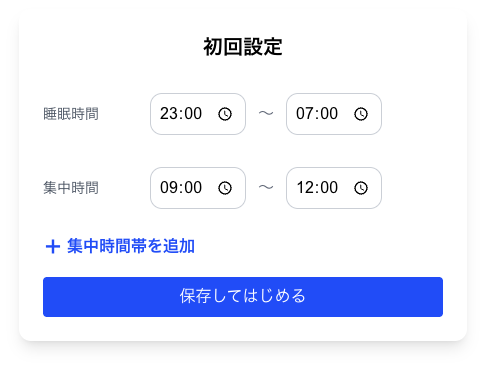

<h1 align="center">☕ Caffe-Run</h1>

  
  
  

  集中力の最大化をサポートする <b>カフェイン最適化アプリ</b> 
  睡眠・集中時間に基づいたAIによる摂取スケジュール提案＆可視化ツール

## 🚀 デプロイ

🔗 [https://caffe-run-flax.vercel.app/](https://caffe-run-flax.vercel.app/)

 

## ✨ こんなアプリ！

* ⏰ 睡眠・集中時間を元に、最適なカフェイン摂取スケジュールを自動生成
* 📈 カフェイン効果と集中力の推移をインタラクティブなグラフで可視化
* 🧍 Unity 3Dキャラクターがリアルタイムに集中力を表現
* 🧠 GPT-4o-mini によるAIアドバイス機能付き
* 💾 localStorageでのデータ永続化（オフラインでも利用可）

 

## 📹 デモ動画

  

### ⚙️ 初期設定画面

<table>
<tr>
<td></td>
<td>

初回起動時に睡眠時間と集中時間帯を設定。  
これにより、あなたの生活リズムに最適化された摂取プランが自動生成されます。

</td>
</tr>
</table>

### 🖥️ メイン画面

<table>
<tr>
<td></td>
<td>
  
    現在時刻・摂取履歴・推奨スケジュールを一覧できる操作画面。 
    Unityキャラクターや集中力グラフもここに表示されます。
  
</td>

</tr>
</table>

### 📊 ダッシュボード & AIアドバイス

<table>
<tr>
<td></td>
<td>

1日の摂取記録や集中力の変化を振り返る分析画面。  
GPT-4o-miniによるアドバイスで、より良いパフォーマンス習慣をサポート。

</td>
</tr>
</table>

---

## 🧠 使用技術スタック

| 区分      | 技術                                 |
| ------- | ---------------------------------- |
| フロントエンド | Next.js 15 / React 19 / TypeScript |
| UI      | Tailwind CSS / Headless UI         |
| データ可視化  | Recharts                           |
| 3D描画    | Unity WebGL + react-unity-webgl    |
| AIアドバイス | OpenAI GPT-4o-mini API             |
| ストレージ   | localStorage（クライアントサイド）            |

---

## 🧪 背景モデル

本アプリは以下のモデルに基づいて動作しています：

* 📚 **薬物動態学モデル**：カフェインの吸収・代謝・排出のシミュレーション
* 🕰️ **概日リズムモデル**：体内時計に基づく自然な集中変化を反映
* 📊 **集中力予測モデル**：ユーザーの生活リズムと摂取履歴に応じた予測
* ⚙️ **最適化アルゴリズム**：目標パフォーマンスを維持しつつ副作用を最小化

---

## 🖱️ 使い方（How to Use）

1. アプリを開く：[https://caffe-run-flax.vercel.app/](https://caffe-run-flax.vercel.app/)
2. 初期設定（睡眠時間・集中時間）を入力
3. 推奨されるカフェイン摂取スケジュールを確認
4. 実際の摂取を記録し、集中力の変化を3Dキャラとグラフで観察
5. AIアドバイスを活用して日々の改善へ

---

## 🏆 受賞実績

🎖 技育CAMP ハッカソン Vol.5 にて「努力賞」を受賞しました！
[📸 ハッカソン投稿をXで見る](https://x.com/geek_pjt/status/1936716140849590644)

---

💬 もしこのプロジェクトが役に立ったら、ぜひ Star ⭐️ をお願いします！
